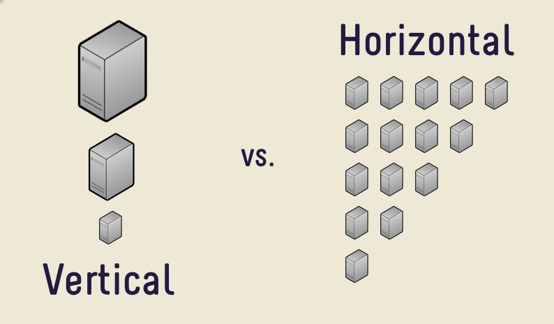

class: center, middle

<h4 style="color:skyblue;">Software Engineering Patterns</h4>

<h1 style="font-size: 4em">12 Factor App</h1>

### Arian Akbari

 

Quera

February 2020

---

class: center,middle
<!--------------------------------------------------------------------------------------------------------------------->
<h1 style="font-size: 4em">Concepts</h1>

---

# ...aaS Models

---

# SaaS

In the modern era, software is commonly delivered as a service:
- called *web apps*
- or *software-as-a-service* (SaaS)

A third-party provider hosts applications and makes them available
to customers over the Internet.

---

# Cloud Scalability

- Scale **UP** vs. Scale **OUT**
- You can't scale up forever.
- **Horizontal** scaling is the winner!

---

# CI/CD

...

---

class: center,middle
<!--------------------------------------------------------------------------------------------------------------------->
<h1 style="font-size: 4em">Introduction</h1>

---

# 12 Factor App?

> Guidelines for building scalable **SaaS** (software-as-a-service) apps.

- **Raises awareness** of some systemic problems in modern app development
- Provides a **shared vocabulary** for discussing those problems
- Offers a set of **conceptual solutions**

---

# Why is it important? 

- **Declarative** formats for setup automation
- **Minimize divergence** between prod/dev
- **Maximum portability** between execution environments
- Deployment on modern **cloud platforms**
- Enables **continuous deployment**
- **Scale** easily

---

# History

- Manifesto written around **2012**
- By **Adam Wiggins**
  - at **Heroku** (Early cloud PaaS)
- Website: <a href="http://12factor.net">12factor.net</a>

---

# For Who?

- Any **developer** building applications which run as a **service**
- **Ops engineers** who deploy or manage such applications

---
class: center,middle

# And Docker!

Docker helps you with 12 factor app a lot!

---

class:center,middle
<!--------------------------------------------------------------------------------------------------------------------->
<h1 style="font-size: 4em">The Factors</h1>

---

layout: true

## The Factors

---

|                            |                                                    |
|----------------------------|----------------------------------------------------|
| **1. Codebase**            | One codebase, many deploys                         |
| **2. Dependencies**        | Explicitly declare and isolate                     |
| **3. Config**              | Store in the environment                           |
| **4. Backing Services**    | Treat as attached resources                        |
| **5. Build, Release, Run** | Strictly separate build & run stages               |
| **6. Processes**           | Execute the app as one or more stateless processes |

---

|                         |                                                                      |
|-------------------------|----------------------------------------------------------------------|
| **7. Port Binding**     | Export services via port binding                                     |
| **8. Concurrency**      | Scale out via the process model                                      |
| **9. Disposability**    | Maximize robustness with fast startup and graceful shutdown      |
| **10. Dev/Prod Parity** | Keep development, staging, and production as similar as possible |
| **11. Logs**            | Treat logs as event streams                                          |
| **12. Admin Processes** | Run admin/management tasks as one-off processes                      |

---
layout: false

## 1. Codebase

> One codebase (repo) tracked in revision control, many deploys

- Single app per repo (1-to-1)
- Multiple repos
  - not an app
  - a distributed system

---

## 2. Dependencies

> Explicitly declare and isolate dependencies

- Never rely on implicit existence of system-wide packages
  - ... or system tools (e.g. curl, ImageMagick)
- Supports reproducible builds

- Declare dependencies in a **manifest**
  - `pip`, `requirements.txt`, `pyproject.toml`
- Use a dependency **isolation** tool
  - `virtualenv`

**HIGH IMPORTANCE!**

---
layout: true

## 3. Config

> Store config in the environment

---

Config is anything that may **vary between deploys**
- Including:
  - Resource handles (database, cache, ...)
  - Credentials
  - Per-deploy values (e.g. canonical hostname)
- Does not include internal application config that don't vary between deploys
  - They should be in the code

---

Store config in **environment variables**
- Strict separation of config from code
- language-agnostic, OS-agnostic
- Granular control, orthogonality
  - Instead of **grouping** configs into named groups (e.g. `development`, `test`, `production`)
    which does not scale cleanly.

Tools exist that load config from `.env` files
- `python-dotenv`, `phpdotenv`, `dotenv` for Node.js, ...

---
layout: true

## 4. Backing Services

---

> Treat backing services as attached resources

| &nbsp;                            | Local                | Third-party        |
|-----------------------------------|----------------------|--------------------|
| **Databases**                     | PostgreSQL, CouchDB  | Amazon RDS         |
| **Caching systems**               | Memcached, Redis     | Amazon Elasticache |
| **Messaging/Queueing systems**    | RabbitMQ, Beanstalkd | Amazon SQS         |
| **SMTP services**                 | Postfix              | Mailgun            |
| **Storage services**              |                      | Amazon S3          |
| ...                               |                      |                    |

---

**No distinction between local and third party services**
- Allows great flexibility
- Loose coupling to the attached deploy
- Resources can be _attached_ and _detached_ to deploys at will, **no code changes**
  - e.g. You can easily swap local PostgreSQL with another DB server of your own, or Amazon RDS.

---
layout: true

## 5. Build, Release, Run

> Strictly separate **build**, **release** and **run** stages

---

- **Build** : Converts code repo into an executable bundle
- **Release** : Build with deploy's current config, ready for immediate execution
- **Run** : Launches a set of app's processes against a selected release

---

- It is impossible to make changes to the code at runtime.
- Releases should have unique ID.
- Releases cannot be mutated. Any change must create a new release.
- You can **rollback** to previous release ID.

---
layout: false

## 6. Processes

> Execute the app as one or more stateless _processes_

Processes should be **stateless** and **share-nothing**.
- Any data that needs to persist must be stored in a stateful backing service, typically a database.

Caching
- The memory space of process can be used as cache **just for a single transaction**!
- Use caching service (e.g. Redis) for inter-process cache.
  - e.g. for user session data

Asset compilation
- Should be in **build** stage.

---

## 7. Port binding

> Export services via port binding

- App **should be self-contained** and export its services
- Exports services (e.g. HTTP) by binding to a port and awaiting incoming requests
- A routing layer (e.g. nginx) is used to route requests from a public-facing hostname to the port-bound web processes
- Typically a webserver library is added to app as a dependency.
    - e.g. Jetty for JVM, Thin for Ruby, Tornado/uWSGI for Python
- One app can become the backing service for another app

---
layout: true
## 8. Concurrency

> Scale out via the process model

---

- Individual processes can handle their own internal multiplexing
  - via threads, async/evented, ...
- **BUT**, app must be able to span multiple **processes**!
  - Processes are a first class citizen

---

- Never self-daemonize or write PID files
- Instead, use OS process manager
  - e.g. `systemd`
  - Manage output streams, Respond to crashed processes, Handle restarts and shutdowns

---
layout: false

## 9. Disposability

> Maximize robustness with **fast startup** and **graceful shutdown**

- Processes should be **disposable**:
  - Start **quickly**
  - Shutdown **gracefully**  (when receiving `SIGTERM`)
  - Be robust against **sudden death**
- Fast startup provides more agility for the release process and scaling up

---
## 10. Dev/Prod parity

> Keep development, staging, and production as similar as possible

- Designed for continuous deployment (CD)
- Keep the **gap** between development and production small:
  - **Time gap**: long time to prod **vs.** CI & deploy ASAP
  - **Personnel gap**: developers code, ops deploy **vs.** Devops
  - **Tools gap**: different stack **vs.** similar stack
- Resists to use different backing services between dev and prod

---

## 11. Logs

> Treat logs as event streams

- App never concerns itself with **routing** or **storage** of its output stream
- Event stream is written to `STDOUT`
- Captured by execution environment
  - Use log routers (such as Logplex and Fluentd)

---

## 12. Admin Processes

> Run admin/management tasks as one-off processes

One-off admin tasks include:
- DB migrations (`manage.py migrate`)
- Console / REPL Shell (`manage.py shell`)
- One-time scripts committed into repo (`scripts/fix_bad_records.py`)

Admin tasks
- Run as separate process
- Run against the same release
- Admin code must ship with app code
- Same dependency isolation techniques (e.g. use the same virtualenv)

---

class: center,middle

# Thank You!

---

layout: false
## References
<!--------------------------------------------------------------------------------------------------------------------->

https://12factor.net

https://dev.to/heroku/twelve-factor-apps-a-retrospective-and-look-forward-4j4f

https://medium.com/hashmapinc/how-i-use-the-twelve-factor-app-methodology-for-building-saas-applications-with-java-scala-4cdb668cc908

https://dev.to/simon_sugob/the-twelve-factor-appa-successful-microservices-guideline-3a1h

https://www.slideshare.net/rudiyardley/the-12-factor-app?qid=d56bf5db-74b9-48ed-a1be-360771b56cdc&v=&b=&from_search=1

https://www.slideshare.net/labianchin/12-factor-app?qid=d56bf5db-74b9-48ed-a1be-360771b56cdc&v=&b=&from_search=7

http://pudgylogic.blogspot.com/2016/01/horizontal-vs-vertical-scaling.html

---
## Report Issues

If you found an issue or have a suggestion, feel free to contact us.

<a class="github-button" href="https://github.com/QueraTeam/presentations/issues" data-icon="octicon-issue-opened" data-size="large" aria-label="Issue QueraTeam/presentations on GitHub">Report Issues</a>