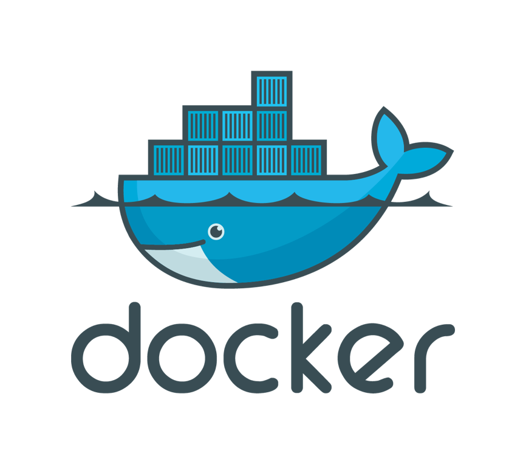
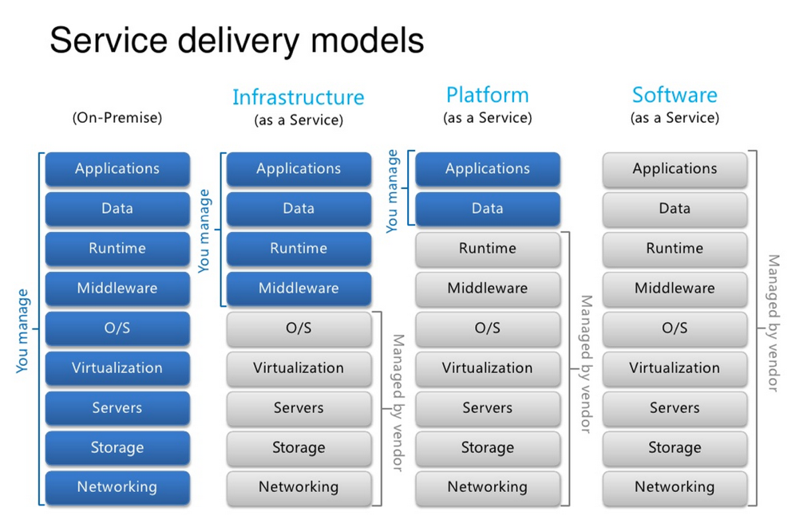

class: center, middle

<h4 style="color:skyblue;">Software Engineering Patterns</h4>
# 12 Factor App

### Arian Akbari

 

Quera

January 2020

---

layout: true
## Introduction
<!--------------------------------------------------------------------------------------------------------------------->

---

#### What is 12 Factor App?

- Methodology for building **software-as-a-service** in the **Cloud**

---

#### Why is it important? 

- **Declarative** formats for setup automation

- **Minimize divergence** between prod/dev

- **Maximum** portability between execution environments

- **Deployment** on modern cloud platforms

- Enables **continuous deployment**

- **Scale up** easily

---

#### History
 - Manifesto written around **2012**
 - by **Adam Wiggins**
   - **Heroku** (Early cloud PaaS)
    
 - Website: <a href="http://12factor.net">12factor.net</a>

---
#### For Who?
- **Any developer** building applications which run as a **service**
- Ops engineers who deploy or manage such applications

---
layout: true

---
class: center,middle

# And Docker!

---
class: center,middle

## If you use docker in production you probably **already** have a 12 factor app!

---
class: center,middle

# ...AAS Models

<h3 style="color:skyblue">... As a Service Models</h3>

---

layout: true

## AAS Models

---

---
layout: true

---
class:center,middle

# The Factors!

---

layout: true

## The Factors

---
1. Codebase
  - One Codebase Many Deploys

2. Dependencies
  - Explicitly Declare and Isolate

3. Config
  -  Store in The Environment
  
4. Backing Services
  - As Attached Resources
  
5. Build Release Run
  - Strictly Separate Build & Run Stages
  

---

6. Processes
  - Execute The App As One or More Stateless Processes

7. Port Binding
  - Export Services Via Port Binding
  
8. Concurrency
  - Scale Out Via The Process Model

9. Disposability
  - Maximise Robustness With Fast Startup And Graceful Shutdown
  
10. Dev Prod Parity 
  - Keep Development,Staging And Production As Similar As Possible

---

11. Logs
  - Treat Logs As Event Streams
  
12. Admin Processes
  - Run Management Tasks As One-Off Processes

---
layout: false

## 1. Codebase

One codebase tracked in revision control, many deploys

- Single app per codebase

---

## 2. Dependencies

Explicitly declare and isolate dependencies

- Never rely on the implicit existence of any system tools
  - Example: curl

- Supports reproducible builds

- Examples of tools: pip/virtualenv, npm/yarn, ...

**HIGH IMPORTANCE!**

---

## 3. Config

Store configuration in the environment **(NOT code)**

- Config is anything that may **vary between deploys**:
  - Resource handles
  - Credentials
  - Canonical hostname for the deploy

- Strict separation of config from code

- Does not include internal application config (like Spring)

---

## 4. Backing Services

Treat backing services as attached resources

- No distinction between local and third party services

- Allows great flexibility

- Loose coupling to the attached deploy

- Resources can be attached and detached to deploys at will, no code changes

---

## 5. Build Release Run

Strictly separate build, release and run stages

- **Build** : Converts code repo into an executable bundle

- **Release** : Build with deploy's current config, ready for immediate execution

- **Run** : Launches a set of app's processes against a selected release

---
## 6. Processes

Execute the app as one or more stateless processes

- Stateless and share-nothing

- Session data should be stored with a time-expiration, e.g. Memcached or Redis

- Stateless means:
  - More robust
  - Easier to manage
  - Incurs fewer bugs
  - Scales better

---
## 7. Port binding

Export services via port binding

- Exports HTTP as a service by binding to a port

- Routing layer to handle requests routing to a hostname

- Uses Webserver libraries such as Jetty for JVM or Thin for Ruby

- One app can become the backing service for another app

---
## 8. Concurrency

Scale out via the process model

- Processes are a first class citizen

- Never daemonize or write PID files

- Relies on OS process manager (upstart, systemd, launchd, foreman, ...) to:
  - Manage output streams
  - Respond to crashed processes
  - Handle restarts and shutdowns
  

---
## 8. Concurrency

---

## 9. Disposability

Maximize robustness with fast startup and graceful shutdown

- Can be started or stopped at a moment’s notice

- Maximize robustness with fast startup and graceful shutdown

- Gracefully shut down when receiving a SIGTERM signal

- Processes should be robust against sudden death

---
## 10. Dev/Prod parity

Keep development, staging, and production as similar as possible

- Designed for continuous deployment

- Keep the gap between development and production small:
  - Time gap: long time to prod
  - Personnel gap: developers code, ops deploy
  - Tools gap: different stack
  
- Resists to use different backing services between dev and prod

---

## 11. Logs

Treat logs as event streams

- Event stream is written to STDOUT

- Use log routers (such as Logplex and Fluent)

---
## 12. Admin Processes

Run admin/management tasks as one-off processes

- Run against a release: same code and config as any process run against that release

- Must ship with application code to avoid synchronization issues

- e.g. Database migration

---

class: center,middle

# Thank You!

---

layout: false
## References
<!--------------------------------------------------------------------------------------------------------------------->

https://12factor.net

https://dev.to/heroku/twelve-factor-apps-a-retrospective-and-look-forward-4j4f

https://medium.com/hashmapinc/how-i-use-the-twelve-factor-app-methodology-for-building-saas-applications-with-java-scala-4cdb668cc908

https://dev.to/simon_sugob/the-twelve-factor-appa-successful-microservices-guideline-3a1h

https://www.slideshare.net/rudiyardley/the-12-factor-app?qid=d56bf5db-74b9-48ed-a1be-360771b56cdc&v=&b=&from_search=1

https://www.slideshare.net/labianchin/12-factor-app?qid=d56bf5db-74b9-48ed-a1be-360771b56cdc&v=&b=&from_search=7

---
## Report Issues

If you found an issue or have a suggestion, feel free to contact us.

<a class="github-button" href="https://github.com/QueraTeam/presentations/issues" data-icon="octicon-issue-opened" data-size="large" aria-label="Issue QueraTeam/presentations on GitHub">Report Issues</a>