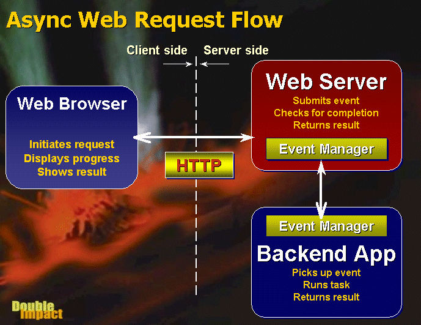

class: center, middle

<u><h1 style="font-size: 4em">Async Programming</h1></u>
## Peyman Najafi
## <p style="color:skyblue;">Quera</p>
October 2020

---
class: middle

- ### Occurrence of events independent of the main program flow.
- ### Without the program blocking to wait for results.
- ### Asynchronous input/output: lets programs issue commands to storage or network devices that service these requests while the processor continues executing the program

---
class: middle

- ### Subroutines (methods, functions) that return to their caller an object:
    - Future: read-only placeholder view of a variable
    - Promise: writable, single assignment container which sets the value of the future
- #### The future is the value, the promise is the function that sets the value
- #### Setting the value of a future is also called resolving, fulfilling, or binding it.

---
class: middle

### Examples of asynchrony

- #### Ajax (short for "asynchronous JavaScript and XML)
- #### AMD (Asynchronous method dispatch): data communication method for the server side to handle a large number of long lasting client requests

---
class: middle

### Scenarios for Async

- #### 1. I/O operations:
    -  making a network call, talking to a database, reading a file, printing a document
 
- #### 2. multiple operations in parallel:
    - database call, web service call


---
class: middle

- #### 3. Long-running event-driven requests
    - Message-based application servers (messages queue)
    

---
class: 

# <u>When to Use (and Not to Use) Asynchronous Programming</u>

- <i class="green check circle outline icon"></i> preloading required data when the app first begins

- <i class="orange exclamation triangle small icon"></i> asynchronously updating records that are dependent or depended upon

- <i class="orange exclamation triangle small icon"></i> single database server without connection pooling (all requests hit the same database using a long running connection)

- <i class="orange exclamation triangle small icon"></i> run simple or short running operations

- <i class="orange exclamation triangle small icon"></i> one resource used by different elements or single thread is responsible for a resource or functionality 
    (conflicts in proper sequence)

- <i class="orange exclamation triangle small icon"></i> forced into asynchronous programming even though you don’t want it!

[//]: # (You may be forced into asynchronous programming even though you don’t want it. Example: I programmed an app that queries Google Fusion Tables on program load. However, App Inventor 2 continues executing other blocks even though results of the Fusion Table queries have not returned. Because of this, you had better not make these subsequent code blocks dependent upon query results or you will get errors. This is one case where a programmer uses asynchronous programming when they really shouldn’t.)


- <i class="green check circle outline icon"></i> make loops asynchronous to avoid blocking the event loop

---
class: 

# <u>When to Use (and Not to Use) Asynchronous Programming</u>

- <i class="green check circle outline icon"></i> large number of iterations or complex operations 

- <i class="orange exclamation triangle small icon"></i> nested anonymous callback functions (AJAX request that depends on an earlier AJAX request)

- <i class="green check circle outline icon"></i> any kind of graphical UI 

- <i class="green check circle outline icon"></i> continue with other work that doesn’t depend on the slow or delayed resource 

- <i class="green check circle outline icon"></i> requests data from multiple different servers 

- <i class="green check circle outline icon"></i> pass SQL write queries to another thread 

[//]: # ( <i class="orange exclamation triangle small icon"></i> bad!)
[//]: # ( <i class="green check circle outline icon"></i> good!) 

---
class: middle

# Javascript: Promises

```javascript
fetch('products.json').then(function(response) {
  
    return response.json();

}).then(function(json) {
  
    console.log('Fetch result: ', json);

}).catch(function(err) {
  
    console.log('Fetch problem: ' + err.message);

});
```

---
class: middle

# Event queue

```javascript
console.log('Starting');
let image;

fetch('coffee.jpg').then((response) => {
  console.log('It worked :)')
  return response.blob();
}).then((myBlob) => {
  let objectURL = URL.createObjectURL(myBlob);
  image = document.createElement('img');
  image.src = objectURL;
  document.body.appendChild(image);
}).catch((error) => {
  console.log('fetch problem: ' + error.message);
});

console.log('All done!');
```

```text
Starting
All done!
It worked :)
```


---
class: 

# Synchronous queue in Python

```python
import queue

def task(name, work_queue):
    if work_queue.empty():
        print(f"Task {name} nothing to do")
    else:
        while not work_queue.empty():
            count = work_queue.get()
            total = 0
            print(f"Task {name} running")
            for x in range(count):
                total += 1
            print(f"Task {name} total: {total}")

work_queue = queue.Queue()
for work in [15, 10, 5, 2]:
    work_queue.put(work)

tasks = [(task, "One", work_queue), (task, "Two", work_queue)]
for t, n, q in tasks:
    t(n, q)


```

---
class: middle

#### > Output:
```text
Task One running
Task One total: 15
Task One running
Task One total: 10
Task One running
Task One total: 5
Task One running
Task One total: 2
Task Two nothing to do
```

---

# Simple Cooperative Concurrency in Python

```python
def task(name, queue):
    while not queue.empty():
        count = queue.get()
        total = 0
        print(f"Task {name} running")
        for x in range(count):
            total += 1
            yield
        print(f"Task {name} total: {total}")
```

---
class: middle

```python
import queue

work_queue = queue.Queue()

for work in [15, 10, 5, 2]:
    work_queue.put(work)

tasks = [task("One", work_queue), task("Two", work_queue)]

done = False
while not done:
    for t in tasks:
        try:
            next(t)
        except StopIteration:
            tasks.remove(t)
        if len(tasks) == 0:
            done = True
```

---
class: middle

#### > Output:

```text
Task One running
Task Two running
Task Two total: 10
Task Two running
Task One total: 15
Task One running
Task Two total: 5
Task One total: 2
```

---
class: middle

# <u>Async IO</u> in Python

- Asynchronous IO (async IO): a language-agnostic paradigm that has implementations across a host of programming languages
- `asyncio`: the Python package that provides a foundation and API for running and managing coroutines
    - introduced in Python 3.4
- `async/await`: two new Python keywords that are used to define coroutines

---
class: middle

# `async`
- `async def`
    - a native coroutine or an asynchronous generator
- `async with`
- `async for`

---
class: middle

# `await`
- passes function control back to the event loop

```python
async def g():
    # Pause here and come back to g() when f() is ready
    r = await f()
    return r
```

---
class: middle

```python
async def f(x):
    y = await z(x)  # OK - `await` and `return` allowed in coroutines
    return y

async def g(x):
    yield x  # OK - this is an async generator

async def m(x):
    yield from gen(x)  # No - SyntaxError

def m(x):
    y = await z(x)  # Still no - SyntaxError (no `async def` here)
    return y
```
---
class: middle

#### `asyncio.sleep`, `asyncio.gather`, `asyncio.run`
```python
# countasync.py

import asyncio

async def count():
    print("One")
    await asyncio.sleep(1)
    print("Two")

async def main():
    await asyncio.gather(count(), count(), count())

if __name__ == "__main__":
    import time
    s = time.perf_counter()
    asyncio.run(main())
    elapsed = time.perf_counter() - s
    print(f"{__file__} executed in {elapsed:0.2f} seconds.")
```

```text
One
One
One
Two
Two
Two
countasync.py executed in 1.01 seconds.
```

---
class: middle

```python
# countsync.py

import time

def count():
    print("One")
    time.sleep(1)
    print("Two")

def main():
    for _ in range(3):
        count()

if __name__ == "__main__":
    s = time.perf_counter()
    main()
    elapsed = time.perf_counter() - s
    print(f"{__file__} executed in {elapsed:0.2f} seconds.")
```

```text
One
Two
One
Two
One
Two
countsync.py executed in 3.01 seconds.
```

---
class: middle

# generator-based coroutine

```python
import asyncio

@asyncio.coroutine
def py34_coro():
    """Generator-based coroutine, older syntax"""
    yield from stuff()

async def py35_coro():
    """Native coroutine, modern syntax"""
    await stuff()
```

---

- 3.3: The `yield from` expression allows for generator delegation.

- 3.4: `asyncio` was introduced in the Python standard library with provisional API status.

- 3.5: `async` and `await` became a part of the Python grammar, used to signify and wait on coroutines. They were not yet reserved keywords. (You could still define functions or variables named async and await.)

- 3.6: `Asynchronous generators` and `asynchronous comprehensions` were introduced. The API of asyncio was declared stable rather than provisional.

- 3.7: `async and await` became reserved keywords.
    - They are intended to replace the `asyncio.coroutine()` decorator.
    - `asyncio.run()` was introduced to the asyncio package, among a bunch of other features.

---
class: center, middle

# <u style="font-size: 3em; ">Thank You<span style="color: skyblue">!</span></u>

---
layout: false

## <u>References</u>

- https://www.codemag.com/Article/0102091/Handling-long-Web-Requests-with-Asynchronous-Request-Processing
- https://stackify.com/when-to-use-asynchronous-programming/amp/
- https://developer.mozilla.org/en-US/docs/Learn/JavaScript/Asynchronous/Introducing
- https://realpython.com/python-async-features/
- https://realpython.com/async-io-python/

<br/>
## <u>Report Issues</u>

If you found an issue or have a suggestion, feel free to contact us.

<a class="github-button" href="https://github.com/QueraTeam/presentations/issues" data-icon="octicon-issue-opened" data-size="large" aria-label="Issue QueraTeam/presentations on GitHub">Report Issues</a>