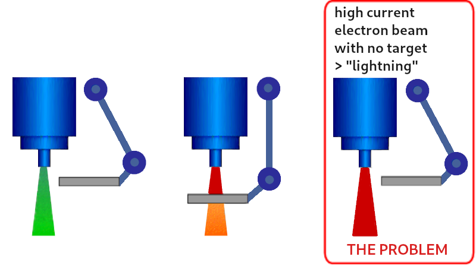
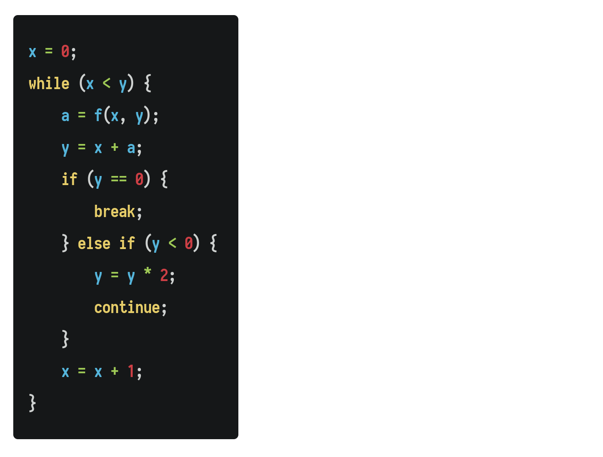
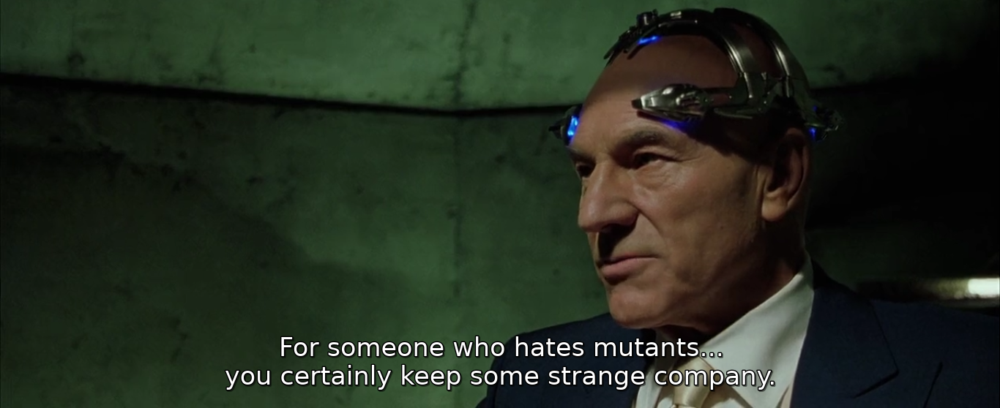
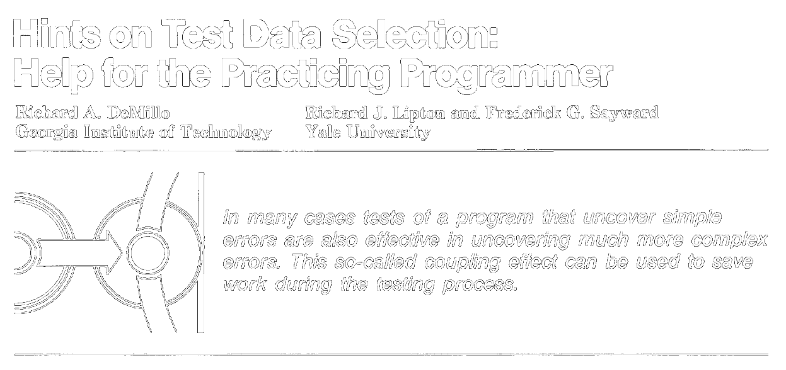
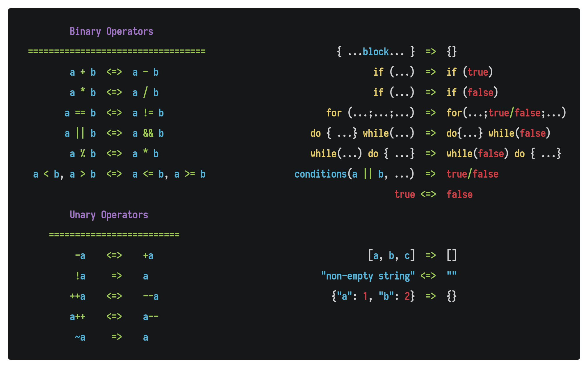
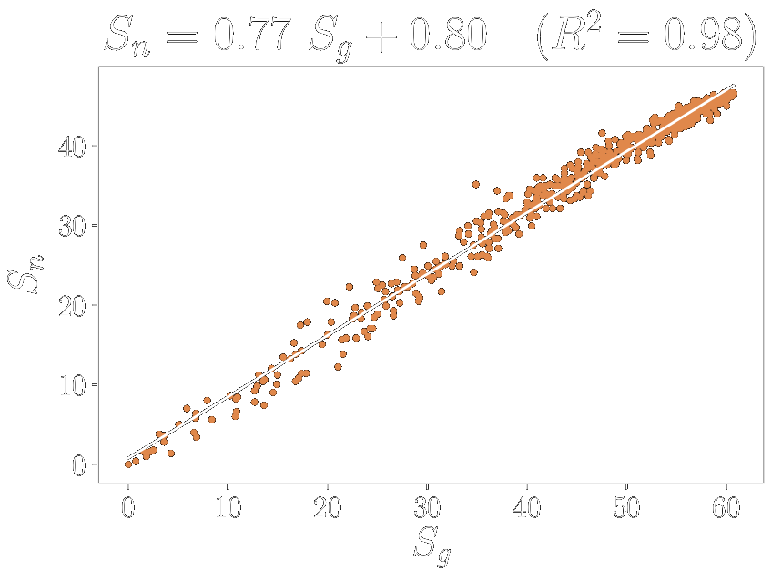

class: center, middle

<b><u><h1 style="font-size: 4em">Measuring   Test Effectiveness</h1></u></b>

### Mohammad Javad Naderi

January 2021

---
layout: true
## What Will We Cover?

---

--

- Introduction to software testing
  - Why software testing is important?
--

- What is an **effective** test suite?
--

- Coverage
--

- Mutation Testing

---
layout: false
background-image: url(images/dark-knight.jpg)
## Why Do We Fall?

---
background-image: url(images/first-bug.jpg)

         
<h2 style="color: #57473e; transform: translateX(71px) rotate(1deg)">Here begins the battle.</h2>

---
background-image: url(images/knight-bg-2.jpg)
## Losing $460M in 45 Minutes

--

- August 1st, 2012

--
- **Knight Capital** deployed a new software update.

--
- At 09:00AM, the New York Stock Exchange opened for trading.

--
- 45 minutes later, Knight Capital’s servers had executed 4 million trades.

--
- Company lost **$460M**.
  - Agreed to be acquired by Getco LLC in December 2012.

--
  
What happened?

- **Dead Code:** "Power Peg" was still present on servers despite not being used.
- **Flag Repurpose:** New code repurposed a flag that was formerly used to activate Power Peg.

---
background-image: url(images/ariane-5-bg.jpg)
## The Ariane 5 Disaster

--
- June 4th, 1996

--
- First test flight failed with the rocket self-destructing 37 seconds after launch.

--
- About **$370M** lost.

--
- Exception-handling bug:
  - forced self-destruct after 64-bit to 16-bit conversion

---
layout: true
background-image: url(images/therac-25-2.jpg)
## Deadly Race Condition in Therac-25

---

--
- Therac-25 was a radiation therapy machine produced in 1982.

--
- Six patients were given massive overdoses of radiation.
  - In three cases, the injured patients later died as a result of the overdose.
  
---
background-image: ""

---
layout: false
background-image: url(images/mars-bg.jpg)
## Mars Climate Orbiter Failure

--

- September 23, 1999

--
- The Mars Climate Orbiter burned up in the Martian atmosphere.

--
- About **$235M** lost.

--

**What happened?**

--
- A software supplied by Lockheed Martin produced results in a **US customary unit**,
    - while a second system, supplied by NASA, expected those results to be in **SI units**.
- The trajectory calculation software then used some results – expected to
  be in newton seconds (incorrect by a factor of 4.45) – to update the predicted position of the spacecraft.

---
layout: false
background-image: url(images/bugs-everywhere.jpg)

--
background-image: ""

## Solution

--
- **Formal Methods**
  - Mathematically rigorous techniques
  - Specification languages based on math (instead of natural language). e.g. **Z Notation**
  - You can **prove** that a program conforms to its specification.
  - Very useful for safety-critical systems.

--
- **Software Testing**
  - Executing a program or application with the intent of finding software bugs

---

## Questions

--
- We write tests to detect software faults as much as possible.
- In order to detect many faults, many good test cases are needed.

--
But

--
- Who validates our tests?
- How much testing is enough (effective)?

--

> We need a criteria to distinguish between *good* and *bad* test suite.

---

## Test Effectiveness Criteria

- Code Coverage
- Mutation Testing

---

## Code Coverage

--
- **Most common** method of measuring test quality.

--
- Calculates how much of code is covered by the test suite.
  - Reported as percentage (%)

--
- Lots of tools

---

## Types of Coverage

There are many types of coverage based on what you want to cover.

--
- **Line Coverage**: has each line of code been executed?
  - most common

--
- **Statement Coverage**: has each statement in the program been executed?

--
- **Function Coverage**: has each function (or subroutine) in the program been called?

--
- **Branch Coverage**: has each branch been executed?

--
- **Graph-based**: cover the graph in some way

--
- ...

---

## Graph-based Coverage Criteria

Before analyzing a source code, we need to convert it to a graph.

--
- AST (Abstract Syntax Tree)
- CFG (Control Flow Graph)

--

**CFG** is simpler than AST and helps measuring code coverage.

--
- Models all executions of a program by describing control structures.
- A directed graph where
  - Each **node** represents a basic block (sequence of statements with no jump or jump target)
  - **Edges** represent control flow
- Essential to many compiler optimizations and static-analysis tools.

---

## Control Flow Graph Example

---

## Coverages Based on CFG

- Node Coverage
- Edge Coverage
- Edge-Pair Coverage
- Simple Path Coverage
- Prime Path Coverage
  - Subsumes node, edge, edge-pair coverage.

---
## Mutation Testing

---
## Mutation Testing

- **Fault**-based technique
  - Automatically seed well-defined small faults
  - Imitate programmer's mistakes (real faults)

--
- History can be traced back to 1971 in a student paper by Richard J. **Lipton**.

--
- The birth of the field: paper published by **DeMillo** et al in 1978:
  - "Hints on test data selection: Help for the practicing programmer"

--

--
- Based on two hypotheses:
  - **Competent Programmer Hypothesis (CPH)**
  - **Coupling Effect**

---

 

---

&nbsp;

--

> **Competent Programmer Hypothesis**
> 
> Programmers are competent,  
> which implies that they tend to develop programs **close to the correct version**.  
> (have merely a few simple faults which can be corrected by a few small syntactical changes)

&nbsp;

--

> **Coupling Effect**
> 
> Test data that distinguishes all programs differing from a correct one by only **simple errors**
> is so sensitive that it also implicitly distinguishes more **complex errors**.

--

A. J. Offutt supported the validity of coupling effect through empirical investigation [1992].

---

## How Does It Work?

--
- Run the test suite on the program

--
- Generate **mutants** using **mutation operators**

--
- Find and remove **invalid** and **equivalent** mutants.

--
- Run the test suite on remaining mutants.

--
- Find mutants which made tests fail (**were killed**)

--
- Calculate **mutation score**:

--

$$MutationScore = \frac{\text{Killed Mutants}}{\text{All Mutants}}$$

---

## Generic Mutation Operators

---

## Code Coverage vs. Mutation Testing

Studies report that:

--
- **Coverage**
  - Not strongly correlated with effectiveness.

--
- **Mutation**
  - Writing test suite with 95% mutation score is difficult, but that test suite will be effective at finding faults.
    [Offutt, 1992]
  - Mutants, using carefully selected operators and after removing equivalent mutants,
    can provide a good indication of the fault detection ability of a test suite. [Andrews et al, 2005]

---

## Mutation Testing Problems

--
- **Cost**
  - All tests must be run against all mutants.
  - When you have a large test suite, it takes a huge amount of time.
  - **Solution:** Select a subset of mutation operators that is as effective as whole set. 

--
- **Equivalent Mutants**
  - Undecidable problem!
  - Needs human intervention
  - 45% of alive mutants are equivalent
  - Checking each mutant takes about 15 minutes.
  - **Workaround:**
    Guided mutation generation process towards parts of code that are more likely to influence the output.
    (reduces the likelihood of generating equivalent mutants)

---

## Tools

- Stryker (JavaScript, TypeScript, C#, Scala)
- Infection (PHP)
- Hambug (PHP)
- Pitest (Java)
- mutmut (Python)
- Cosmic Ray (Python)
- Mutant (Ruby)
- Muter (Swift)
- Mull (C, C++)
- go-mutesting (Go)

---
background-image: url(images/stryker-bg.png)

## Stryker

--
- Open source mutation testing tool for JS, TS, C#, Scala

--
- Written in TypeScript

--
- Internally:
  - Uses babel to generate AST from code
  - Applies mutation operators (mutators) to AST
  - Converts AST back to code

--
- Supports ES6+ and JSX

--
- Complete flow:
  - generating mutants, running tests, killing mutants, reporting

--
- Generic mutators built-in.

--
- Supports popular test runners: Jest, Jasmine, Karma, Mocha

---

 

<h3 style="font-size: 6em; text-align: center; margin: 0;">
Demo Time!
</h3>

Demo project is located in <code>demo-js</code> folder.

---
layout:true
## Bonus: Mutation Operators for React

---

--
- I designed 6 mutation operators for react,
  - and implemented them in Stryker.

--
- Currently for class-based components but can be adopted to function-based.

--
- Purpose: replace generic operators in react apps
  - Decrease number of mutants
  - Take react and JSX specific features into account

--
- Tested on 14 open-source react projects (from 12806 crawled projects)
  - Projects used react features heavily and contained adequate test suite.

--
- **Result:** 85% less mutants generated, mutation score was proportional to previous score 

---

---
layout: false
background-image: url(images/any-questions.jpg)
---
## References

- https://labs.blogs.com/its_alive_in_the_lab/2017/01/the-original-computer-bug.html
- https://mag.quera.ir/worstbugs-knight-j0owwibf4doq
- https://mag.quera.ir/the-ariane-5-disaster-oxgmwgsiv6mq
- https://mag.quera.ir/race-condition-therac-25-iroksmaisgit
- https://mag.quera.ir/bug-day-mars-climate-orbiter-aiz47q8nj17f
- Mohammad Javad Naderi. "Generating Mutants for User Interface Testing in Web-Based Applications" Master Thesis, 2019.
- https://stryker-mutator.io/

If you found an issue or have a suggestion, feel free to contact us.

<a class="github-button" href="https://github.com/QueraTeam/presentations/issues" data-icon="octicon-issue-opened" data-size="large" aria-label="Issue QueraTeam/presentations on GitHub">Report Issues</a>
