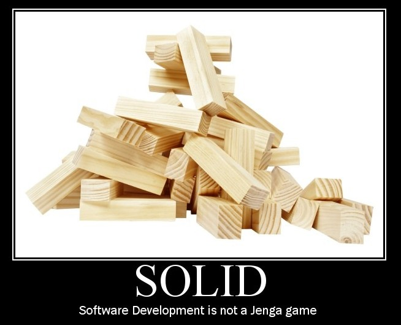
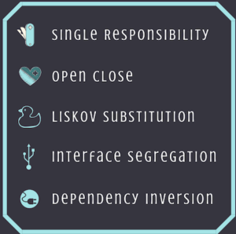
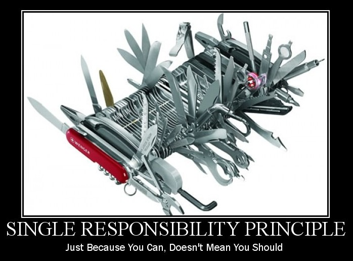
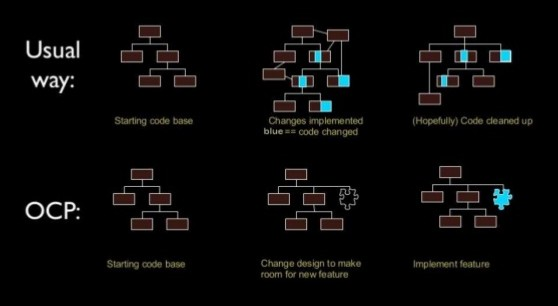
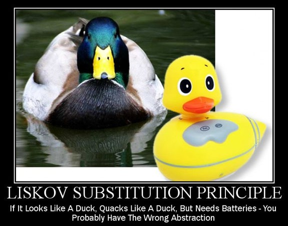
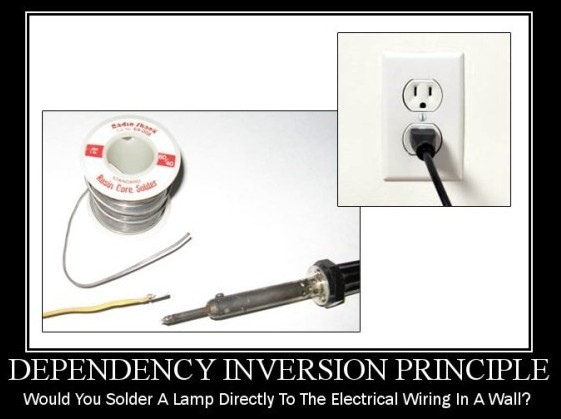

class: center, middle

<h4 style="color:skyblue;">Object-Oriented Programming</h4>
<u><h1 style="font-size: 4em">SOLID principles</h1></u>
### Peyman Najafi
<br/>
Quera
<br/>
February 2020

---
class: middle

# <u>History</u>

- First conceptualized by [Robert Cecil Martin](https://en.wikipedia.org/wiki/Robert_C._Martin) ("Uncle Bob")
- In his 2000 paper: [Design Principles and Design Patterns](https://fi.ort.edu.uy/innovaportal/file/2032/1/design_principles.pdf)
- Later built upon by Michael Feathers, who introduced us to the SOLID acronym
- Revolutionized the world of object-oriented programming in the last 20 years

---
class: middle

## How does it help us write better code?

- ### Encourage us to create more:
    - maintainable,
    - extensible,
    - debuggable,
    - understandable &
    - flexible software

- ### Reduce complexity in grow 

---
class: middle, center



---
class: middle

# <span style="color:skyblue;">S O L I D</span> principles

- ### <strong style="color:skyblue;">S</strong>ingle Responsibility
- ### <strong style="color:skyblue;">O</strong>pen/Closed
- ### <strong style="color:skyblue;">L</strong>iskov Substitution
- ### <strong style="color:skyblue;">I</strong>nterface Segregation
- ### <strong style="color:skyblue;">D</strong>ependency Inversion

---
class: middle, center

# <u>Concepts</u>


---
class: middle

# 1. <strong style="color:skyblue;">S</strong>ingle Responsibility

- ### Class should be having one and only one `responsibility (job)`
- ### It should only have one `reason to change`

---
class: middle

# Benefits of <strong style="color:skyblue;">S</strong>ingle Responsibility 
- <span style="font-size: 1.2em; color: skyblue;">Testing</span> – A class with one responsibility will have far fewer test cases
- <span style="font-size: 1.2em; color: skyblue;">Lower coupling</span> – Less functionality in a single class will have fewer dependencies
- <span style="font-size: 1.2em; color: skyblue;">Organization</span> – Smaller, well-organized classes are easier to search than monolithic ones

---

### Example of <strong style="color:skyblue;">S</strong>ingle Responsibility <i class="orange exclamation triangle small icon"></i>

```python
class Animal:
    def __init__(self, name: str):
        self.name = name
    
    def get_name(self) -> str:
        pass

    def save(self):
        pass
```

- The `Animal` class violates the SRP;
- Two responsibilities:
    - animal `database` management
    - animal `properties` management

---

### Example of <strong style="color:skyblue;">S</strong>ingle Responsibility <i class="orange exclamation triangle small icon"></i>

- Make `Animal` conform to `SRP` : create another class to handle database management

```python
class Animal:
    def __init__(self, name: str):
        self.name = name
    
    def get_name(self):
        pass

class AnimalDB:
    def get_animal(self, id) -> Animal:
        pass

    def save(self, animal: Animal):
        pass
```

- We should put `related features` together
- Downside: clients of the this code have to deal with two classes

---

### Example of <strong style="color:skyblue;">S</strong>ingle Responsibility <i class="green check circle outline icon"></i>

Apply the `Facade` pattern:
```python
class Animal:
    def __init__(self, name: str):
        self.name = name
        self.db = AnimalDB()

    def get_name(self):
        return self.name

    def get(self, id):
        return self.db.get_animal(id)
    
    def save(self):
        self.db.save(animal=self)
```
Animal class will be the Facade for animal database management and animal properties management

---
class: middle, center
## SRP in real world



---
class: middle

# 2. <strong style="color:skyblue;">O</strong>pen/Closed

## Software entities (Classes, modules, functions) should be:
- ## Open for Extension
- ## Closed for Modification

---
class: middle, center

## <span style="color: DarkOrchid">Clever Application</span> design and the code writing part 
## should take care of the <span style="color: skyblue">Frequent Changes</span>



---
### Example of <strong style="color:skyblue;">O</strong>pen/Closed <i class="orange exclamation triangle small icon"></i>

```python
class Animal:
    def __init__(self, name: str):
        self.name = name
    
    def get_name(self) -> str:
        pass

animals = [
    Animal('lion'),
    Animal('mouse'),
    Animal('snake')
]

```

---

### Example of <strong style="color:skyblue;">O</strong>pen/Closed <i class="orange exclamation triangle small icon"></i>

```python
def animal_sound(animals: list):
    for animal in animals:
        if animal.name == 'lion':
            print('roar')
        elif animal.name == 'mouse':
            print('squeak')
        elif animal.name == 'snake':
            print('hiss')

animal_sound(animals)
```

`animal_sound` violates the OCP

---

### Example of <strong style="color:skyblue;">O</strong>pen/Closed <i class="green check circle outline icon"></i>

```python
class Animal:
    name = ''

    def make_sound(self):
        pass

class Lion(Animal):
    name = 'lion'

    def make_sound(self):
        return 'roar'

class Mouse(Animal):
    name = 'mouse'

    def make_sound(self):
        return 'squeak'

def animal_sound(animals: list):
    for animal in animals:
        print(animal.make_sound())

animal_sound([Lion(), Mouse()])

```

Make the `animal_sound` conform to `OCP`

---

### Example of <strong style="color:skyblue;">O</strong>pen/Closed <i class="orange exclamation triangle small icon"></i>

- Discount of 20% to `favorite` customers
- Offer double the 20% discount to `VIP` customers

```python
class Discount:
    def __init__(self, customer, price):
        self.customer = customer
        self.price = price

    def give_discount(self):
        if self.customer == 'fav':
            return self.price * 0.2
        if self.customer == 'vip':
            return self.price * 0.4

```

---

### Example of <strong style="color:skyblue;">O</strong>pen/Closed <i class="green check circle outline icon"></i>

- `Discount` and `VIPDiscount` classes

```python
class Discount:
    def __init__(self, customer, price):
        self.customer = customer
        self.price = price

    def get_discount(self):
        return self.price * 0.2


class VIPDiscount(Discount):
    def get_discount(self):
        return super().get_discount() * 2

```
---
class: middle, center

## OCP in real world
### Dont risk altering core functionality to add a simple feature


---
class: middle

# 3. <strong style="color:skyblue;">L</strong>iskov Substitution

- ### Parent classes should be `easily substituted` with their child classes `without blowing up` the application
- ### Child class should never change the behavior of parent class

---

### Example of <strong style="color:skyblue;">L</strong>iskov Substitution <i class="green check circle outline icon"></i>

```python
class Animal:

    def make_noise(self):
        return 'I am making noise'


class Cat(Animal):

    def make_noise(self):
        return 'meow meow'


class Dog(Animal):

    def make_noise(self):
        return 'bow wow'

```

---

### Example of <strong style="color:skyblue;">L</strong>iskov Substitution <i class="orange exclamation triangle small icon"></i>

```python
class Animal:

    def make_noise(self):
        return 'I am making noise'


class DumbDog(Animal):

    def make_noise(self):
        raise Exception('I cant make noise')

```

---

### Example of <strong style="color:skyblue;">L</strong>iskov Substitution <i class="orange exclamation triangle small icon"></i>

If the code finds `itself checking the type` of class, it violated LSP

```python
def animal_leg_count(animals: list):
    for animal in animals:
        if isinstance(animal, Lion):
            print(lion_leg_count(animal))
        elif isinstance(animal, Mouse):
            print(mouse_leg_count(animal))
        elif isinstance(animal, Pigeon):
            print(pigeon_leg_count(animal))
        
animal_leg_count(animals)

```

### Domino Effect:
- violate `Liskov Substitution`
- violate `Open/Close`

---

### Example of <strong style="color:skyblue;">L</strong>iskov Substitution <i class="green check circle outline icon"></i>

`Animal` class now have to implement a `leg_count` method.  

```python

class Animal:
    def leg_count(self):
        pass


class Lion(Animal):
    def leg_count(self):
        pass


def animal_leg_count(animals: list):
    for animal in animals:
        print(animal.leg_count())
        
animal_leg_count(animals)

```

---
class: middle, center

## LSP in real world


---
class: middle

# 4. <strong style="color:skyblue;">I</strong>nterface Segregation

- ## Clients should not be forced to depend on methods that they do not use.
- ## Larger interfaces should be split into smaller ones.
- ## Tailor interfaces to individual clients needs.

---

### Example of <strong style="color:skyblue;">I</strong>nterface Segregation <i class="orange exclamation triangle small icon"></i>

```python
class IShape:
    def draw_square(self):
        raise NotImplementedError
    
    def draw_rectangle(self):
        raise NotImplementedError
    
    def draw_circle(self):
        raise NotImplementedError

class Square(IShape):
    pass

class Rectangle(IShape):
    pass

class Circle(IShape):
    pass

```

- Now we need `Triangle` !
- Domino Effect: violate `Interface Segregation` -> violate `Open/Close`

---

### Example of <strong style="color:skyblue;">I</strong>nterface Segregation <i class="green check circle outline icon"></i>

```python
class IShape:
    def draw(self):
        raise NotImplementedError

class Circle(IShape):
    def draw(self):
        pass

class Square(IShape):
    def draw(self):
        pass

class Rectangle(IShape):
    def draw(self):
        pass

class Triangle(IShape):
    def draw(self):
        pass
```

---
class: middle, center

## ISP in real world


## Tailor interfaces to individual clients needs.

---
class: middle

# 5. <strong style="color:skyblue;">D</strong>ependency Inversion

- ### Classes should 
    - ### depend on abstraction 
    - ### but not on concretion
    
- ### High-level modules should depend on `abstraction` of low-level level modules.

---

### Example of <strong style="color:skyblue;">D</strong>ependency Inversion <i class="orange exclamation triangle small icon"></i>

```python

class XMLHttpService(XMLHttpRequestService):
    pass

class Http:
    def __init__(self, xml_http_service: XMLHttpService):
        self.xml_http_service = xml_http_service
    
    def get(self, url: str, options: dict):
        self.xml_http_service.request(url, 'GET', options)

    def post(self, url, options: dict):
        self.xml_http_service.request(url, 'POST', options)
```
- `Http` is `high-level` component ; `XMLHttpService` is `low-level` component.

<hr/>

Domino Effect: <br/> 
Need to change the Http connection service <br/>
-> Move through all the instances of Http to edit code! <br/>
-> Violate `Dependency Inversion` <br/>
-> Violate `Open/Close` <br/>

---

### Example of <strong style="color:skyblue;">D</strong>ependency Inversion <i class="green check circle outline icon"></i>

```python
class Connection:
    def request(self, url: str, options: dict):
        raise NotImplementedError

class Http:
    def __init__(self, http_connection: Connection):
        self.http_connection = http_connection
    
    def get(self, url: str, options: dict):
        self.http_connection.request(url, 'GET')

    def post(self, url, options: dict):
        self.http_connection.request(url, 'POST')

```

No matter the type of Http connection service passed to Http.

```python
class XMLHttpService(Connection):
    def request(self, url: str, options:dict):
        pass

class NodeHttpService(Connection):
    def request(self, url: str, options:dict):
        pass
```

---
class: middle, center

## DIP in real world



---
class: center, middle

# <u>Thank You<span style="color: skyblue">!</span></u>

---
layout: false

## <u>References</u>
- https://www.baeldung.com/solid-principles
- https://medium.com/mindorks/solid-principles-explained-with-examples-79d1ce114ace
- https://medium.com/swift-india/solid-principles-part-1-single-responsibility-ccfd4ff34a5a
- https://medium.com/swift-india/solid-principles-part-2-open-closed-principle-bf0514b824ca
- https://medium.com/swift-india/solid-principles-part-3-liskov-substitution-principle-723e025d0589
- https://medium.com/swift-india/solid-principles-part-4-interface-segregation-principle-68b671927c88
- https://medium.com/swift-india/solid-principles-part-5-dependency-inversion-principle-a0a890de71c2

---
layout: false

## <u>References</u>
- https://github.com/heykarimoff/solid.python
- https://cobuildlab.com/development-blog/solid-principles-python-django/
- https://www.youtube.com/watch?v=9DYqQDjBIqw&feature=youtu.be
- https://vrgl.ir/hZQBZ
- http://web.archive.org/web/20160521015258/https://lostechies.com/derickbailey/2009/02/11/solid-development-principles-in-motivational-pictures/


<br/>
## <u>Report Issues</u>

If you found an issue or have a suggestion, feel free to contact us.

<a class="github-button" href="https://github.com/QueraTeam/presentations/issues" data-icon="octicon-issue-opened" data-size="large" aria-label="Issue QueraTeam/presentations on GitHub">Report Issues</a>