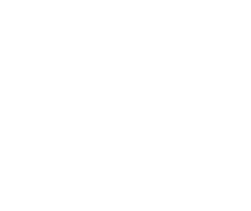
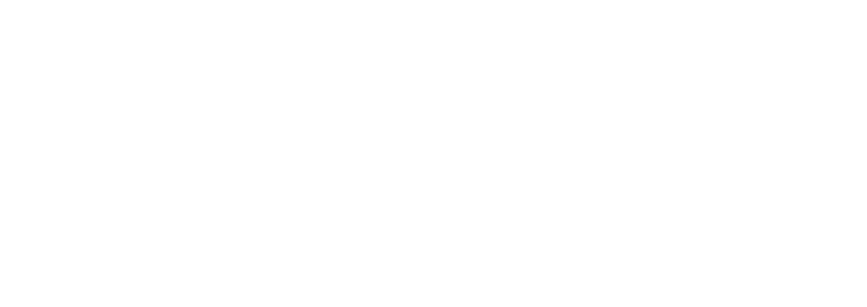
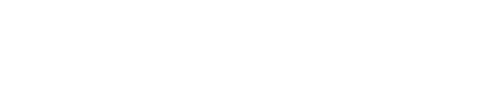
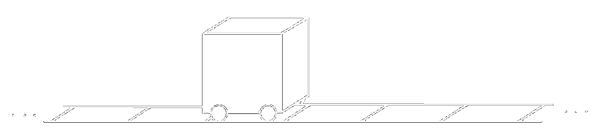
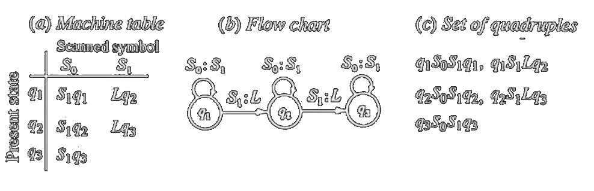
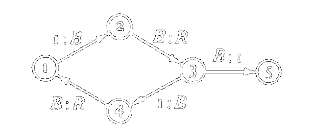
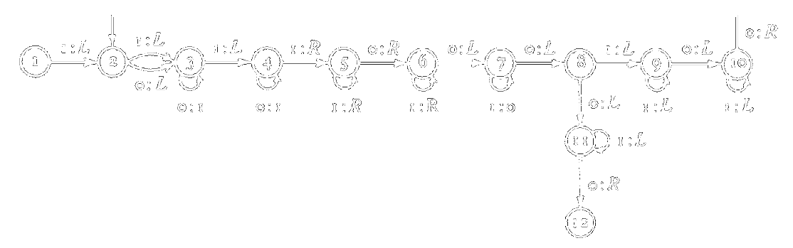
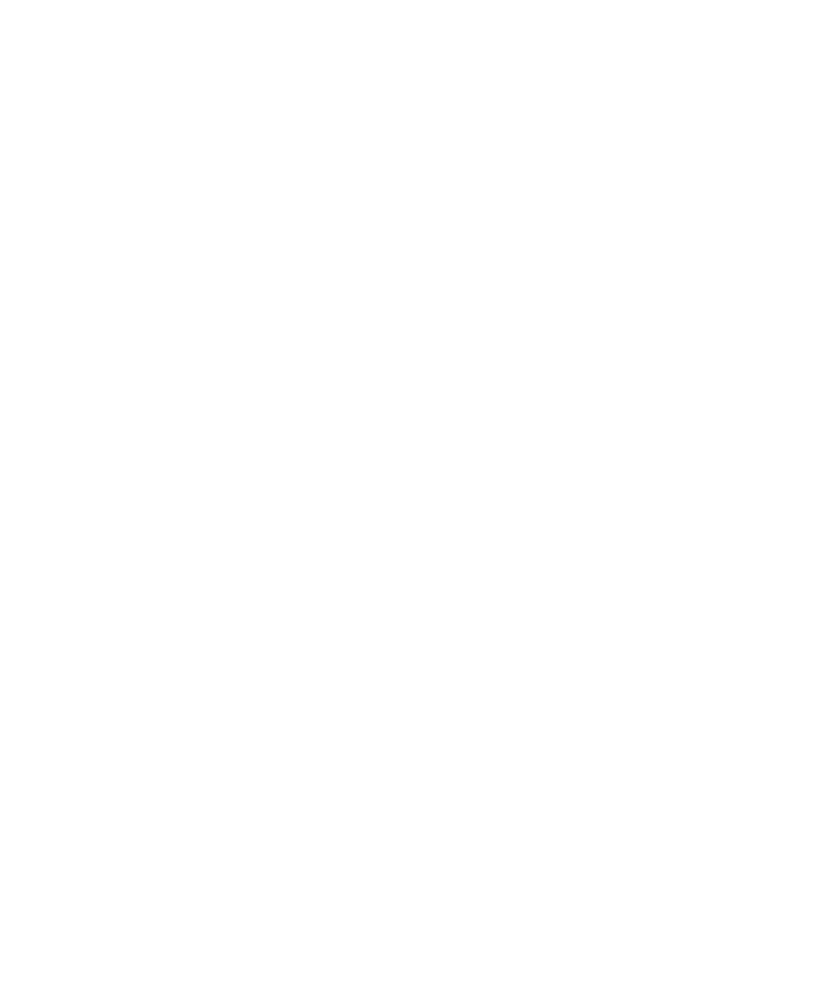
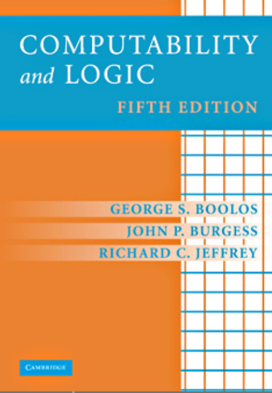

class: center, middle

<b><u><h1 style="font-size: 4em">Introduction to the <br> Theory of Computation</h1></u></b>

Part One

### Mohammad Javad Naderi

July 2021

---
layout: true
## What Will We Cover?

---

- A Brief Intro
- Enumerability
- Diagonalization
- Turing Computability

---
layout: false
background-image: url(images/bg/abacus.jpg)
## What Are We Talking About?

---

## Related Stuff

- **Automata** Theory (Automata is the plural form for **Automaton**)
  - e.g. DFA, NFA, Buchi, ...
  - finite/infinite input
  - finite/infinite states
- **Computational Complexity** Theory
  - $O(\lg n)$, $O(n \lg n)$, $O(n^2)$, ...
  - P, NP
- **Language** Theory
  - Grammars, Compilers, NLP, RegExp, ...
- **Logic**
  - First-order logic, Higher-order logic, ...

---
layout: false
background-image: url(images/bg/dominos.jpg)
## Enumerability

---

## Enumerability

- Our ultimate goal will be to present some celebrated theorems about **inherent limits** on
  what can be **computed** and on what can be **proved**.
- What is computability? What is provability?
  - Computations involve positive integers 1, 2, 3, ...
  - Proofs consist of sequences of symbols from the usual alphabet A, B, C, ... or some other.
- It is important to understand the relationship between **positive integers**
  and **sequences of symbols**.
  

---

## Enumerable (Countable) Set

> A set whose members can be enumerated: arranged in a single list

- Set $P$ of positive integers: $1, 2, 3, 4, ...$
- Set $N$ of natural numbers: $0, 1, 2, 3, ...$
- Set $P^{-}$ of negative integers: $-1, -2, -3, -4, ...$
- Empty set $\emptyset$ is regarded as enumerable.
- This is not acceptable: $1, 3, 5, 7, ..., 2, 4, 6, 8, ...$
- Redundancy is OK: $1, 1, 2, 2, 3, 3, ...$
- Gaps are OK: $1, -, 3, -, 5, -, ...$
- Each list: function $f$ with positive integers as arguments and set members as values
  - total or partial
    
---

## Sets of Pairs

Zig-zag move in a table:



Imagine a hotel with an enumerable infinity of rooms...

$(1, 1), (2, 1), (1, 2), (3, 1), (1, 3), (2, 2), (1, 4), (4, 1), (1, 5), (2, 3), ...$

---

## Examples of Enumerable Sets

- The set of positive rational numbers
- The set of rational numbers
- The set of ordered triples of positive integers
- The set of ordered k-tuples of positive integers, for any fixed k
- The set of finite sequences of positive integers less than 10
- The set of finite sequences of positive integers less than b, for any fixed b
- The set of finite sequences of positive integers
- The set of finite sets of positive integers
- Any subset of an enumerable set
- The union of any two enumerable sets
- The set of finite strings from a finite or enumerable alphabet of symbols

---
layout: false
background-image: url(images/bg/kent-tupas-u7SCebzS57Q-unsplash.jpg)
## Diagonalization

---

## Diagonalization

> Not every set is enumerable!

**Cantor's Theorem:** The set of all sets of positive integers ($P^{*}$) is not enumerable.

**Proof summary:**

From any list $L$ of sets of positive integers, we discover a set $\Delta(L)$
of positive integers which is not a member of $L$.

---

## Proof of Cantor's Theorem

- We argue by *reductio ad absurdum*.



$$1-s_1(1), 1-s_2(2), 1-s_3(3), 1-s_4(4), ...$$

---

## Imagine a Superhuman Enumerator...

- **Zeus** can enumerate any enumerable set in only 1 second!
  - How?


- Zeus even can enumerate an infinite sequence of infinite lists in 1 second!
- But, Cantor proved that there are sets which even Zeus cannot enumerate.
  - No matter how fast he works, or how long. Even, infinitely long...

---

## Once We Have One, We Get Others

The set of real numbers is not enumerable.

- Consider only numbers between 0 and 1.
- And consider only numbers with 0 and 1 digits in their decimal notation.
```
0.1             1
0.01            2
0.11            1, 2
0.001           3
0.101           1, 3
...
0.010101...     2, 4, 6, ...
0.111111...     1, 2, 3, ...
```
- If this set of real numbers is enumerable, $P^*$ is enumerable too.

---
layout: false
background-image: url(images/bg/imitation-game.jpg)
## Turing Computability

---

## Computation

- Zeus can write the whole table of values of a function on positive integers.
- Humans can't do this. Resources are limited.
- Fortunately, there is no need to do this.
  - We need values one at a time.
  - Given $n$, we need the value of $f(n)$.
  - We need a list of instructions to compute the value of $f(n)$.

---

## Effectively Computable Functions

> A function is **effectively computable** if there are definite, explicit rules by following which
one could in principle compute its value for any given arguments.

- In practice, a human or machine **can't** compute the value of $f(n)$ for **any** given $n$.
- In theory, it can be done in a **finite** amount of time, but...
  - This finite amount of time can be longer than your life.
  - Eventually you’d be trying to write on molecules, on atoms, on electrons.
- But let's **ignore** these practical limitations
  - and work with an **idealized** notion of computability.
- In next talk, we will prove that certain functions are **not computable**,
  - even if we overcome all practical limitations.

---

## Introducing Turing-computable Functions

- Effective computability is an intuitive notion.
- We need a formalism.
- Introduce **Turing-computable** functions.

---

## Is Turing-computable == effectively computable ?

- One side is obvious from definition of Turing machine.
  - Every Turing-computable function is effectively computable.
- The converse is known as **Turing's Thesis**.
  - Not obvious
  - Can't be proved rigorously. (Because the notion of effective computability is intuitive)
  - There is an enormous amount of evidence...

---

## Numeral System in Turing Machines

- We need a **numeral system** for representing arguments and values.
- Computations can be harder with some notations (e.g. Roman numerals)
- Every numeral system can be used,
  - as long as **translation** between the systems can be carried out according to explicit rules.
- For purposes of framing a rigorously defined notion of computability,
  - it is convenient to use **monadic** or tally notation.
    
$$1, 11, 111, 1111, ...$$

---

## Turing Machine

- Computation takes place on a **tape**, unending in both directions.
- Each square is blank ($S_0$ or $0$), or has a stroke ($S_1$ or $1$).
- Has one of a finite number of **internal states**.
- Has a program. At each stage according to the current state and scanned symbol:
  - Acts on tape + Internal state changes
- Possible actions in each stage:
  - Erase, Print, Move left, Move right, Halt



---

## A Turing Machine Program



Prints three strokes and halts.

- [Gist](https://gist.github.com/mjnaderi/f6ef957e4ef3a44fc42ec2dc5a061c36)
- **[Demo!](https://turingmachine.io/?import-gist=f6ef957e4ef3a44fc42ec2dc5a061c36)**

---

## Example: Determining Parity



- [Gist](https://gist.github.com/mjnaderi/776a71ddb8a4d3ded2ab397957515c89)
- **[Demo!](https://turingmachine.io/?import-gist=776a71ddb8a4d3ded2ab397957515c89)**

---

## Example: Multiplication by 2



- [Gist](https://gist.github.com/mjnaderi/c2537d940134be328170f50249526fc8)
- **[Demo!](https://turingmachine.io/?import-gist=c2537d940134be328170f50249526fc8)**

---

## Example: Sum of Two Positive Integers

- [Gist](https://gist.github.com/mjnaderi/63cf060a4ed7273f995c2379c697ec9a)
- **[Demo!](https://turingmachine.io/?import-gist=63cf060a4ed7273f995c2379c697ec9a)**

---

## Example: Product of Two Positive Integers



- Uses **leapfrog routine**.

```
111_1111
_11_____1111
__1_________1111
____111111111111
```

- Leapfrog:

```
1111
_111_1
__11_11
___1_111
____1111

```

---

## Problems

1. Consider a tape containing a block of $n$ strokes, followed by a space, followed
by a block of $m$ strokes, followed by a space, followed by a block of $k$ strokes,
and otherwise blank. Design a Turing machine that when started on the leftmost
stroke will eventually halt, having neither printed nor erased anything ...
  - (a) ... on the leftmost stroke of the second block.
  - (b) ... on the leftmost stroke of the third block.
2. Continuing the preceding problem, design a Turing machine that when started
on the leftmost stroke will eventually halt, having neither printed nor erased
anything ...
  - (a) ... on the rightmost stroke of the second block.
  - (b) ... on the rightmost stroke of the third block.

---
layout: false
background-image: url(images/any-questions.jpg)
---
## References

<div id="before-references"></div>



- Boolos, George S., John P. Burgess, and Richard C. Jeffrey. Computability and logic. Cambridge university press, 2007.

If you found an issue or have a suggestion, feel free to contact us.

<a class="github-button" href="https://github.com/QueraTeam/presentations/issues" data-icon="octicon-issue-opened" data-size="large" aria-label="Issue QueraTeam/presentations on GitHub">Report Issues</a>
